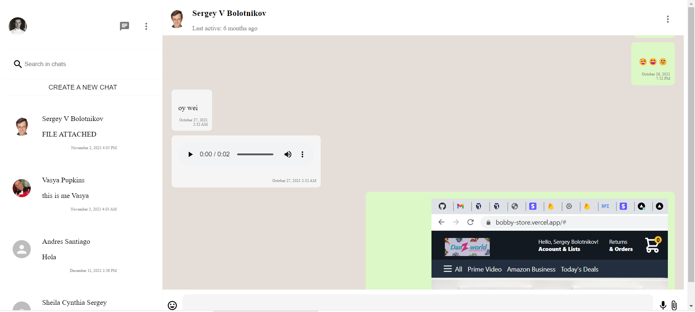
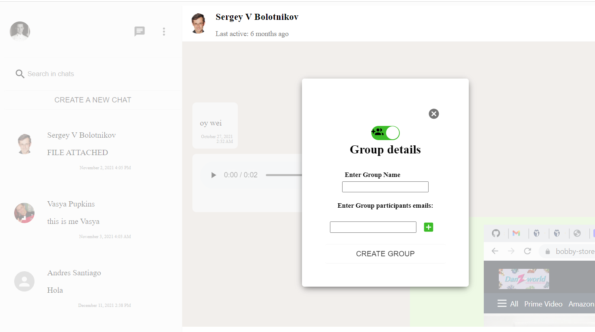
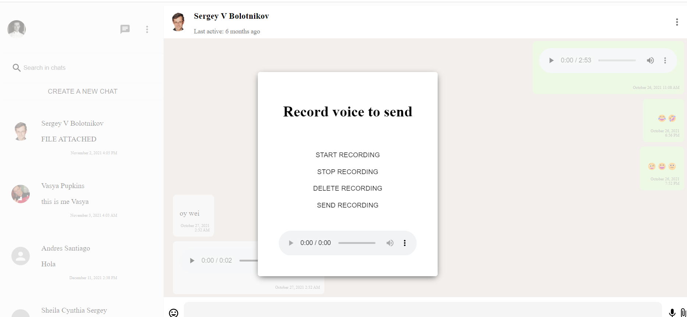
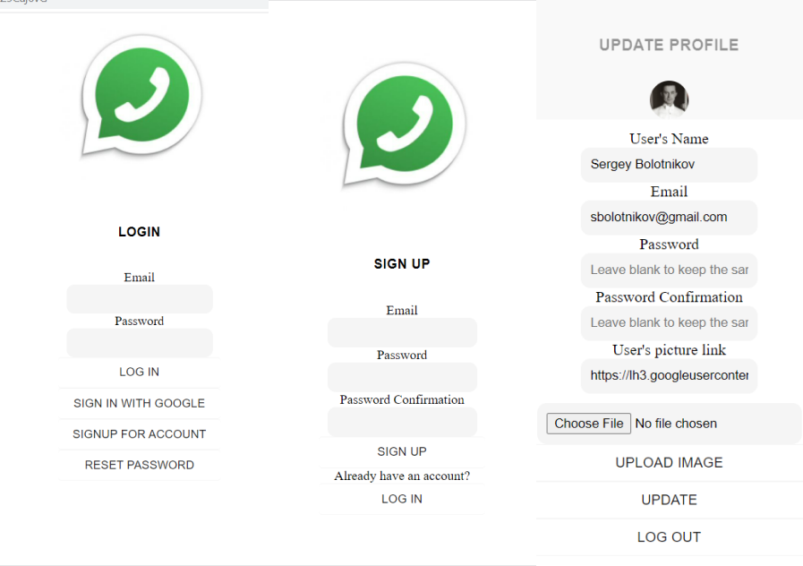
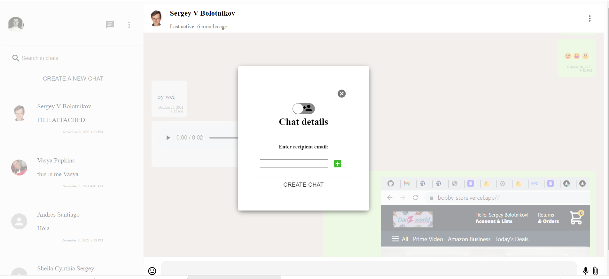
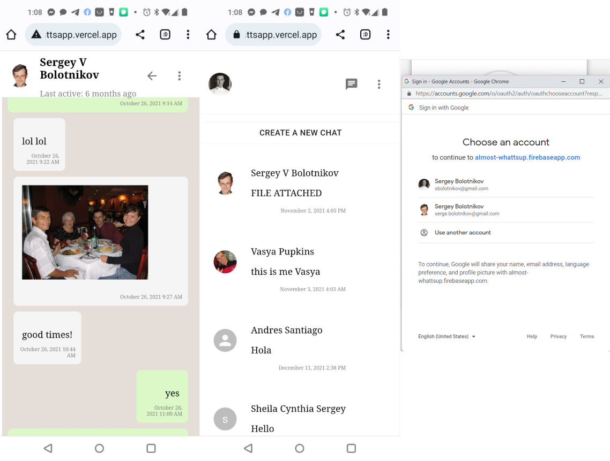
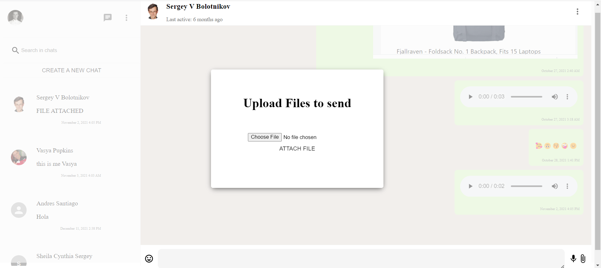

# Almost WhattsApp 
## Description 
https://github.com/sbolotnikov/almost-whattsapp
Almost Whattsapp is a personal project using the Firebase DB, NextJS, NextAuth .

Lesser technologies: cloudinary, styled-components, material UI, dotenv, react-firebase-hooks, emoji-picker and more.

Responsive chat application. You can send chat messages with emoji, voice messages, send files(video, pictures). It also supports group chats.

Users are able to log in directly using email/password or using integration with Google OAuth. They can update their profile picture and upload pictures for the tests using cloudinary.

## Table of Contents
* [Installation](#installation)
* [Usage](#usage)
* [License](#license)
* [Questions](#questions)
* [Review](#review)
## Installation 
Simply clone the repo, and/or visit the deployed page link to begin.

### Chat on desktop
 

### Starting new group chat
 

### Voice recording screen
 

### Log in, Sign in, Profile screenshots
 

### Starting new single person chat screen
 

### Mobile screenshots and Google sign in
 

### Upload file screen
 

## Contributing 
 None 
## License 
 Licensed under MIT License. 
## Tests 
 None
## Questions 
 You can see more of my Projects on my [GitHub profile](https://github.com/sbolotnikov) 
 Contact me with any questions or suggestions!
 * Sergey Bolotnikov [sbolotnikov](mailto:sbolotnikov@gmail.com)
## Review 
  * Here is this repo link: https://github.com/sbolotnikov/almost-whattsapp
 
  * Link: [Almost WhattsApp](https://almost-whattsapp.vercel.app)